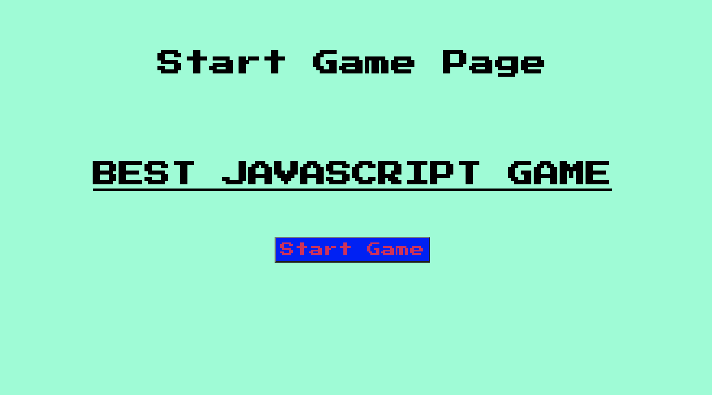
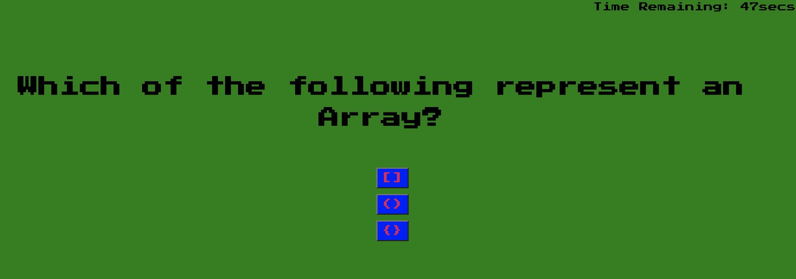
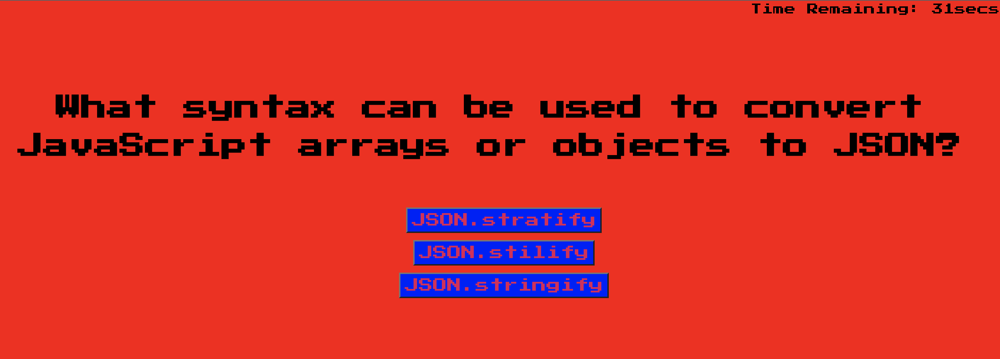
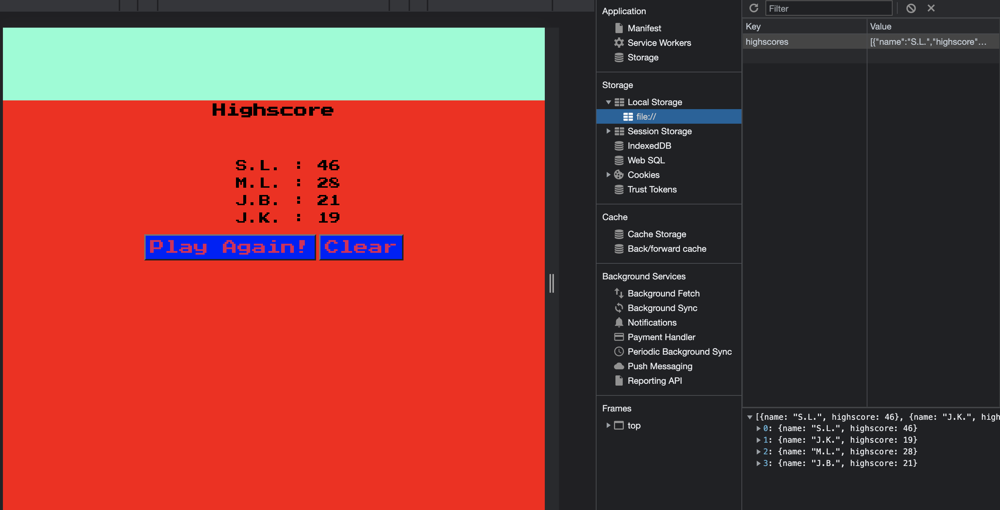

# Technicolor-DreamQuiz
*Quiz created with JavaScript UWA week 4 homework*

> **The following is a ten question quiz with multiple choice answers based on JavaScript syntax and it's application. The user starts the quiz and is prompted when an incorrect or correct answer is selected (background turns green for correct, red for incorrect). Time is deducted in increments of 5seconds when an incorrect answer is selected. The quiz will end when all questions have been answered correctly or the one minute timer reaches zero. The user is then able to submit their initials to be added to the local storage with their final score. Scores can be cleared or the quiz can be re-initialized.**

*Start game landing page*

*Correct answer chosen*

*Incorrect answer chosen*

*Input initials with local storage*

>**The final result can be found at the following URL:** https://lev8947.github.io/Technicolor-DreamQuiz/